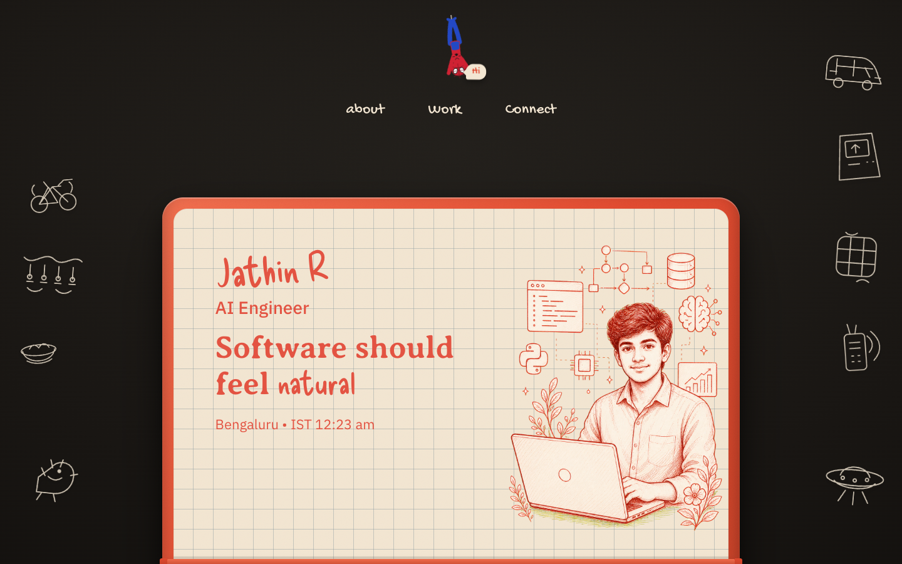
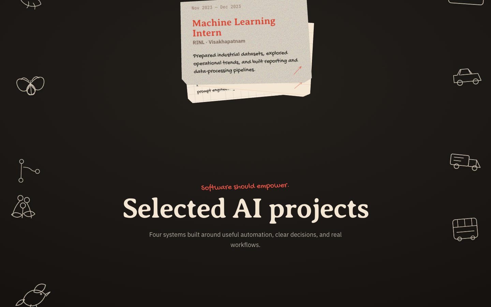

# Jathin R Portfolio

Personal portfolio website for Jathin R, built with React, Vite, Framer Motion, Lenis smooth scrolling, and Vercel Analytics.

Live site: [rjathin.com](https://www.rjathin.com/)

## What it includes

- Notebook-style hero section
- Animated side doodles
- Experience journey section with role cards and summary text
- Selected AI projects linked to GitHub
- Technical skills section
- Work board style project showcase
- Contact section with email, LinkedIn, and GitHub
- Vercel Analytics integration

## Latest update

Added supporting text to the experience notebook area so the section feels more complete and explains the journey from data analysis to AI automation and GenAI systems.

## Screenshots

### Home



### Work section



## Tech Stack

- React
- Vite
- Framer Motion
- Lenis
- JavaScript
- HTML/CSS
- Vercel Analytics

## Run locally

```bash
npm install
npm run dev
```

## Build

```bash
npm run build
```

## Contact

- Email: [jathinr0709@gmail.com](mailto:jathinr0709@gmail.com)
- LinkedIn: [linkedin.com/in/rjathin](https://www.linkedin.com/in/rjathin/)
- GitHub: [github.com/jathinr0709](https://github.com/jathinr0709)
